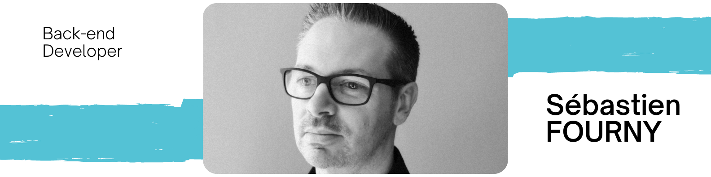

### Hi there 👋, my name is Sébastien
#### I am Back-end developer

I made this project just for fun, it allows you to create nice and simple GitHub Readme files that you can copy/paste and use in your profile.

Skills:  JS / HTML / CSS / React / Vue

- 🔭 I’m currently working on this Application for a fishing associationge. 
- 🌱 I’m currently learning VueJs, ReactJs 
- 📫 How to reach me: sebastien.fourny28@gmail.com 

          

  

  

  

  

  

  
